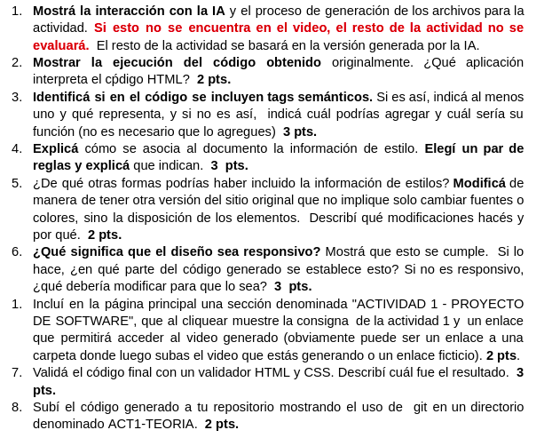

# Proyecto de Software 2023 - Teoría - Actividad 1
## Descripción
Este es el repositorio de la actividad 1 de la teoría de Proyecto de Software 2023.

[Carpeta con el Video](https://1drv.ms/f/s!AmIkOMP8I9h-h61-QStr5XRdg9wExQ?e=lZvthS)

El archivo `chatgpt log.pdf` contiene en versión pdf la interacción con ChatGPT.

Los archivos `consigna1.png` y `consigna2.png` contienen la consigna para la actividad:

